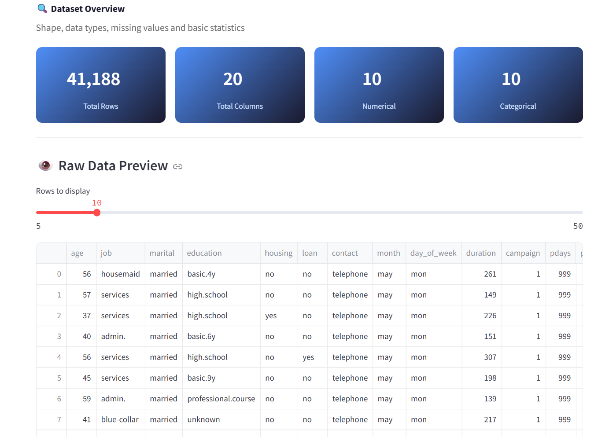
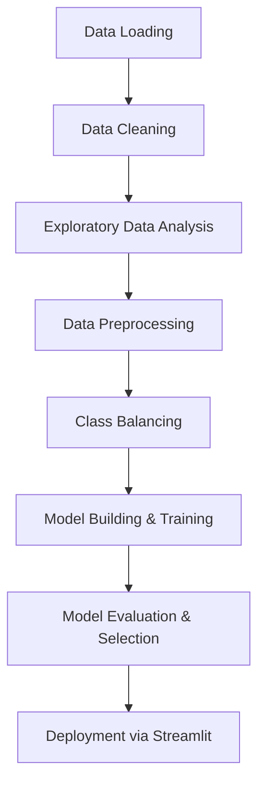
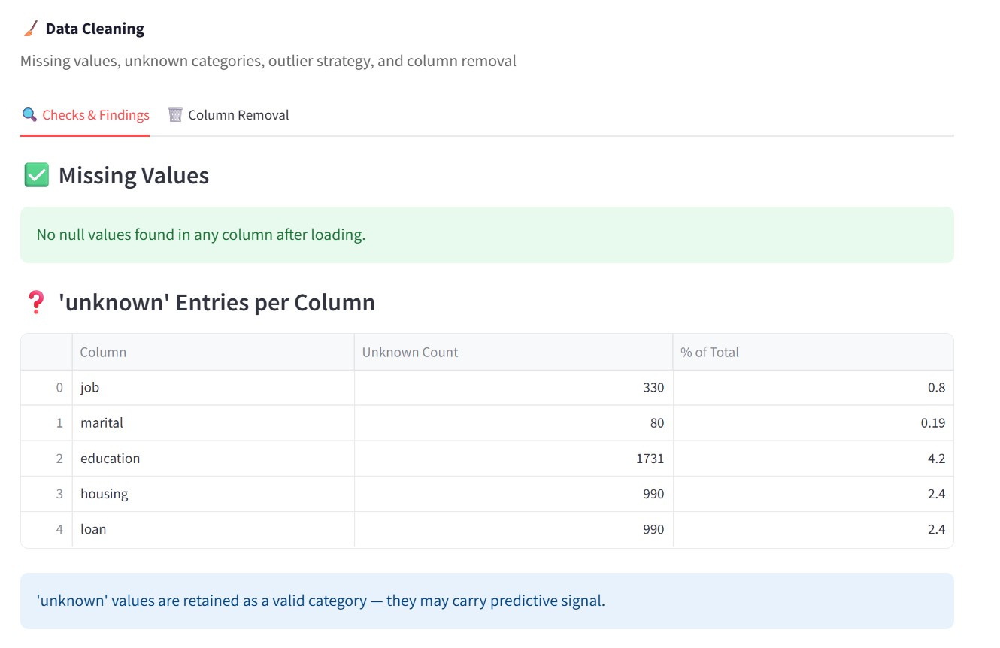
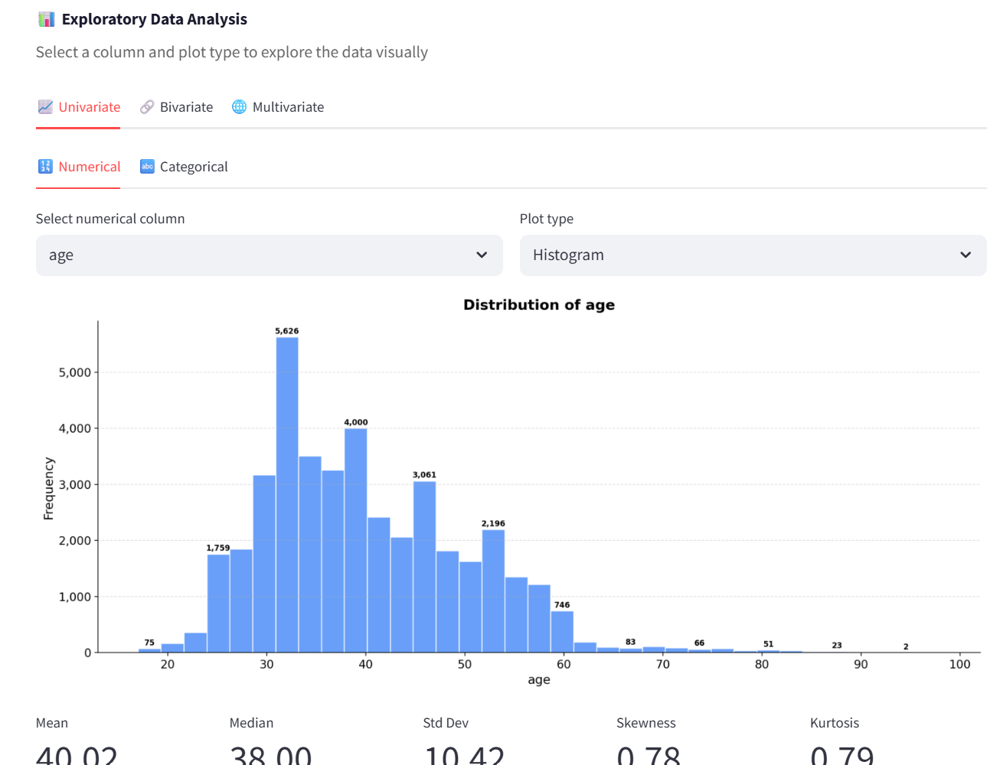
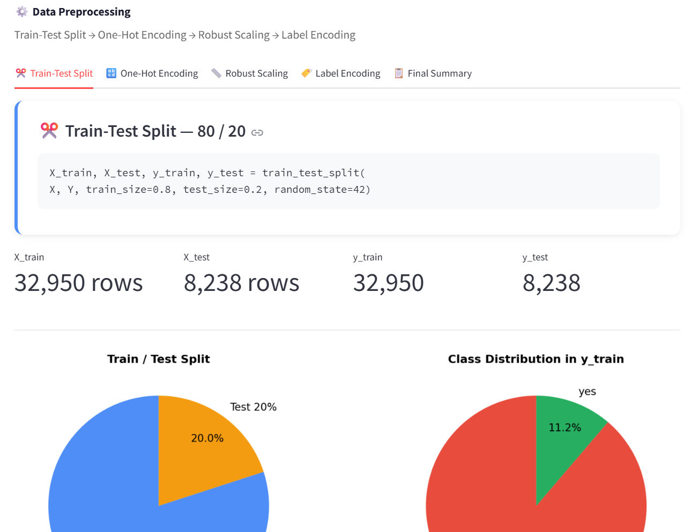
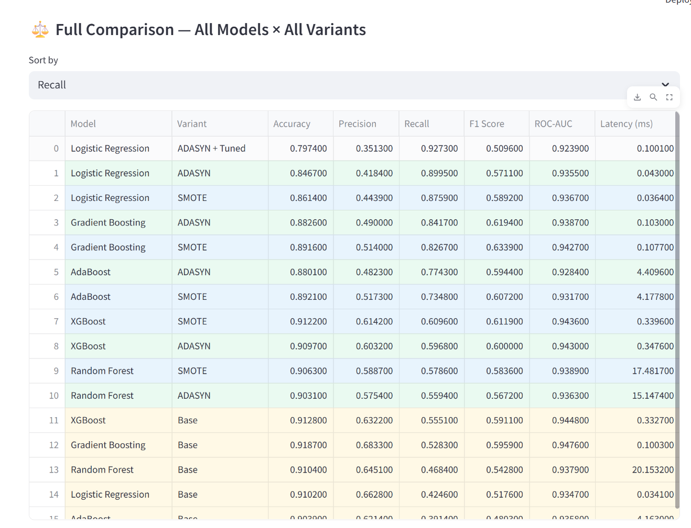
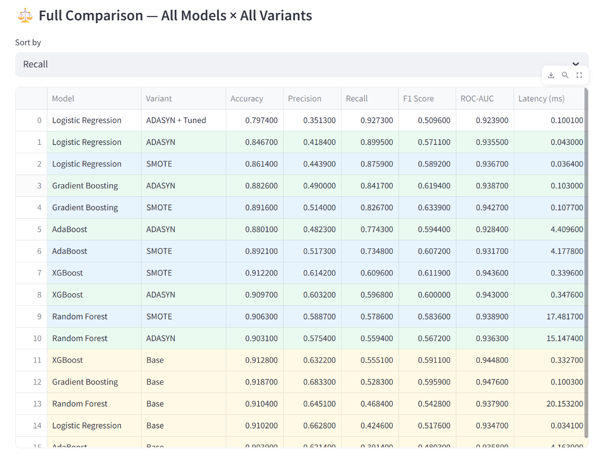
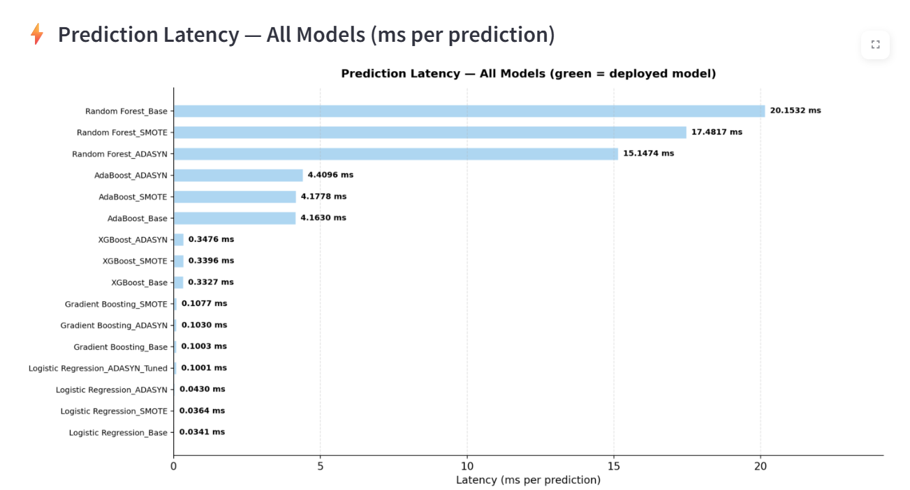
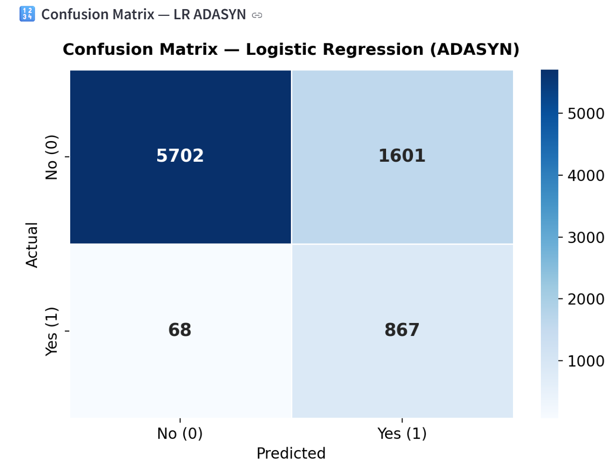
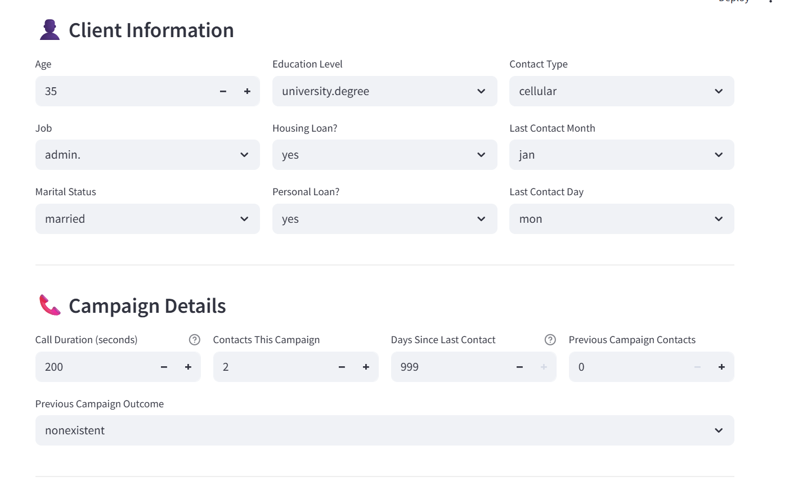

# 🏦 Bank Marketing ML Project


[**[Live App Link Placeholder]**](#) | [**[Dataset Source Link: UCI Machine Learning Repository]**](https://archive.ics.uci.edu/ml/datasets/bank+marketing)

## 📋 Table of Contents
1. [Business Problem](#-business-problem)
2. [Problem Statement](#-problem-statement)
3. [Dataset Overview](#-dataset-overview)
4. [Project Workflow](#-project-workflow)
5. [Data Cleaning](#-data-cleaning)
6. [EDA](#-eda)
7. [Data Preprocessing](#-data-preprocessing)
8. [Model Building](#-model-building)
9. [Model Comparison](#-model-comparison)
10. [Final Model Decision](#-final-model-decision)
11. [Streamlit App](#-streamlit-app)
12. [Tech Stack](#-tech-stack)
13. [How to Run Locally](#-how-to-run-locally)
14. [Project Structure](#-project-structure)
15. [Conclusion](#-conclusion)
16. [Author](#-author)

## 🎯 Business Problem
The bank wants to predict the likelihood of a client subscribing to a term deposit based on direct marketing campaigns (phone calls). By accurately predicting potential subscribers, the bank can optimize telemarketing campaigns, focus efforts on clients most likely to subscribe, and significantly reduce operational costs.

## 📦 Problem Statement
This is a supervised binary classification project. The goal is to classify the target column `y` as 'yes' or 'no'.
**Key Assumptions/Decisions:**
- The `default` column was dropped due to a high number of unknown values and near-zero variance.
- Class imbalance was addressed using SMOTE and ADASYN techniques.
- **Recall** is prioritized as the key performance metric to minimize False Negatives (missed subscribers).

## 🔍 Dataset Overview
The project uses the UCI Bank Marketing dataset (`bank-additional-full.csv`), consisting of **41,188 rows** and **21 columns**.

### Class Distribution
| Class | Count | Percentage |
| :--- | :--- | :--- |
| **no** | 36,548 | ~88.7% |
| **yes** | 4,640 | ~11.3% |

> **Warning:** The dataset is highly imbalanced, which heavily influences the preprocessing and evaluation strategy.



## 📑 Project Workflow


## 🧹 Data Cleaning
- **Missing Values:** No missing values were found.
- **Dropped Columns:** `default` was dropped because ~20% of its values were 'unknown' and the remaining known values had near-zero variance.
- **Unknowns Retained:** 'unknown' values in other categorical columns were kept as a distinct category.
- **Outliers:** No outlier removal was performed. Instead, `RobustScaler` was utilized during preprocessing.



## 📊 EDA (Exploratory Data Analysis)
The Streamlit app features comprehensive EDA capabilities with interactive selectors for:
- **Univariate Analysis:** Distribution of individual features.
- **Bivariate Analysis:** Relationships between features and the target variable.
- **Multivariate Analysis:** Exploring interactions between multiple features.

**Key Finding:** Multicollinearity was detected among economic indicators (`emp.var.rate`, `euribor3m`, `nr.employed`).



## ⚙️ Data Preprocessing
- **Train/Test Split:** 80/20 split.
- **Encoding:** One-Hot Encoding via `pd.get_dummies` was applied to 9 categorical columns. The test set was reindexed to align with the training set columns.
- **Target Encoding:** `LabelEncoder` was applied to the target (`no` = 0, `yes` = 1).
- **Scaling:** `RobustScaler` was applied to numerical features.
  > **Why RobustScaler?** Unlike `StandardScaler`, it scales using the Interquartile Range (IQR). This makes the model resistant and insensitive to outliers.

### Final Data Shapes
| Dataset | Shape |
| :--- | :--- |
| **X_train_sc** | (32950, 62) |
| **X_test_sc** | (8238, 62) |



## 🤖 Model Building
We trained and evaluated **6 algorithms** across **3 balancing variants** (Base, SMOTE, ADASYN) resulting in 15 base combinations, plus hyperparameter tuning.
**Algorithms Evaluated:** Logistic Regression, Random Forest, XGBoost, Gradient Boosting, AdaBoost.
**Metrics Logged:** Accuracy, Precision, Recall, F1 Score, ROC-AUC, Confusion Matrix, Prediction Latency (ms per 1000 predictions).

## 🔮 Model Comparison

> **Why Recall over ROC-AUC?**
> In this highly imbalanced dataset, Accuracy is misleading (the Accuracy Paradox). A model predicting "no" for everyone would be ~88% accurate but useless. For the bank, a **False Negative** means a missed subscriber and direct revenue loss. While ROC-AUC measures overall separability, it doesn't penalize false negatives enough. We prioritized **Recall** because the asymmetric cost of errors makes missing a subscriber far more costly than making an extra phone call (False Positive).

### Performance Table (Key Models)
| Model | Variant | Recall | ROC-AUC | Latency (ms) |
| :--- | :--- | :--- | :--- | :--- |
| **Logistic Regression** | Base | 0.4246 | 0.9347 | 0.0341 |
| **Logistic Regression** | ADASYN | 0.8995 | 0.9355 | 0.0430 |
| **Logistic Regression** | **ADASYN + Tuned** | **0.9273** | 0.9239 | **0.1001** |
| Random Forest | Base | 0.4684 | 0.9379 | 20.1532 |
| XGBoost | ADASYN | 0.5968 | 0.9430 | 0.3476 |
| Gradient Boosting | Base | 0.5283 | 0.9476 | 0.1003 |
| Gradient Boosting | ADASYN | 0.8417 | 0.9387 | 0.1030 |
| AdaBoost | ADASYN | 0.7743 | 0.9284 | 4.4096 |




## 🏆 Final Model Decision
**Deployed Model:** Logistic Regression with ADASYN (Tuned)
**Hyperparameters:** `{'tol': 0.01, 'solver': 'saga', 'max_iter': 2000, 'C': 0.001}`

While Gradient Boosting (Base) achieved the highest ROC-AUC (0.9476), it suffered from high False Negatives (Recall = 0.5283), meaning it missed roughly half of the potential subscribers (missing ~441 out of 935 actual subscribers).

By deploying **Logistic Regression with ADASYN (Tuned)**, we accepted a slight tradeoff in ROC-AUC (0.9239) to achieve an exceptional **Recall of 0.9273**.
- **Business Impact:** Out of 935 actual subscribers in the test set, this model missed **only 68** (False Negatives).
- **Latency:** It operates at an ultra-fast **0.1001 ms per sample**, significantly outperforming tree-based models and making it highly suitable for real-time deployment.




## 📱 Streamlit App
The project is deployed as an interactive 11-page Streamlit app.
1. **Home:** Project introduction and objectives.
2. **Dataset:** View the raw dataset and shape.
3. **Data Cleaning:** Overview of cleaning steps applied.
4. **Univariate Analysis:** Interactive exploration of individual columns.
5. **Bivariate Analysis:** Target relationships with features.
6. **Multivariate Analysis:** Exploring multicollinearity.
7. **Preprocessing:** Steps taken to prepare the data.
8. **Class Imbalance:** Visualizing the original distribution vs. SMOTE/ADASYN.
9. **Model Building:** Summary of the algorithms trained.
10. **Evaluation:** Interactive dashboards to compare model metrics.
11. **Predict:** Make live predictions. Users input client info, campaign details, and economic indicators (auto-filled with dataset defaults). The output yields a 'Yes' / 'No' prediction along with the calculated probability.



## 💻 Tech Stack
- **Python**
- **Pandas** & **NumPy**
- **Matplotlib** & **Seaborn**
- **Scikit-learn**
- **XGBoost**
- **imbalanced-learn**
- **Joblib**
- **Streamlit**

## 🚀 How to Run Locally
1. Clone the repository:
   ```bash
   git clone <repo-url>
   cd <repo-folder>
   ```
2. Create and activate a virtual environment (optional but recommended):
   ```bash
   python -m venv venv
   source venv/bin/activate  # On Windows use `venv\Scripts\activate`
   ```
3. Install dependencies:
   ```bash
   pip install -r requirements.txt
   ```
4. *(Optional)* Re-run the data preparation pipeline:
   ```bash
   python preprocessing.py
   python models.py
   ```
5. Launch the Streamlit app:
   ```bash
   streamlit run app.py
   ```

## 📁 Project Structure
```text
.
├── app.py                      # Main Streamlit application
├── preprocessing.py            # Data cleaning & preprocessing script (if available)
├── models.py                   # Model training and tuning script
├── bank-additional-full.csv    # Raw dataset
├── requirements.txt            # Python dependencies
└── models/                     # Saved artifacts
    ├── preprocessed_data.joblib
    ├── best_model.joblib
    ├── best_model_info.joblib
    ├── all_metrics.joblib
    └── latency_results.joblib
```

## 🏁 Conclusion
The primary focus of this project was a business-driven model selection. Rather than simply picking the model with the highest Accuracy or ROC-AUC, we critically analyzed the asymmetric cost of misclassification. The chosen model—Logistic Regression with ADASYN—optimizes for Recall, ensuring that the bank successfully identifies the vast majority of potential subscribers, effectively balancing marketing costs with maximum revenue capture.

## 👤 Author
- **[Your Name]**
- [LinkedIn](#) | [GitHub](#) | [Portfolio](#)
